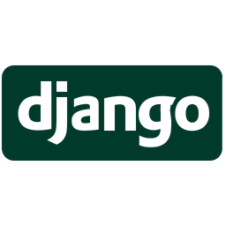
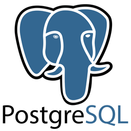

<!DOCTYPE html>
<html lang="sp">
    <head>
        <title> Pablo Nuñez - Portfolio </title>
        <link rel="stylesheet" href="./style.css"/>
        
    </head>

    <body>

        <nav>
            

                

                Pablo Nuñez

                    

                        
                        El_mallic@hotmail.com
                    

                    

                    

                        
                        +59895459150

                    

                

                

                    <a class="topmenu" href="#about-me">  Acerca de mí </a>
                    <a class="topmenu" href="#skills"> Conosimientos </a>
                    <a class="topmenu" href="#projects"> Proyectos </a>
                    <a class="topmenu" href="#recommendation"> Recomendaciones </a>

                

            
    
        </nav>

        <!--  Acerca de mí -->
        <section id="about-me" class="container">
            

                
            

            

                <h1>
                    Hola soy Pablo Nuñez
                </h1>
                

                    Estoy dando un giro en mi vida, hacia el mundo del desarrollo de software. Durante los últimos tres años, me dediqué al trading, lo que me brindó habilidades analíticas y toma de decisiones.
                     
                    A principios del 2023, comencé a estudiar programación y me he centrado en la tecnologías de Python, Django y actualmente estoy aprendiendo sobre REST. Mi pasión por la programación radica en su capacidad para resolver problemas y crear soluciones.
                     
                    Mi objetivo es seguir creciendo como desarrollador, aprovechando mi experiencia previa y mi entusiasmo por el desarrollo de software. Estoy buscando oportunidades emocionantes para contribuir a proyectos y equipos comprometidos.
                

            

        </section>

            <!-- Skills -->
        <section id="skills">
            <h2> Conosimientos </h2>

            

            

                

                    
                    <h6> Python </h6>
                    
 1 año de experiencia 

                
  

                

                    
                    <h6> Dejango </h6>
                    
 1 año de experiencia 

                

                

                    
                    <h6> REST Fremwork </h6>
                    
 1 año de experiencia 

                

                

                    
                    <h6> Flask </h6>
                    
 Menos de 1 año de experiencia 

                
 

                

                    
                    <h6> Postgresql </h6>
                    
 1 año de experiencia 

                
 

                

                    
                    <h6> HTML </h6>
                    
 1 año de experiencia 

                

                

                    
                    <h6> CSS </h6>
                    
 1 año de experiencia 

                

                

                    
                    <h6> JavaScript </h6>
                    
 1 año de experiencia 

                

            

        </section>

            <!-- Projects -->
        <section class="projects" id="projects">
            <h2>
                Proyectos
            </h2>
            

            

                

                    <h3>Descargar videos y MP 3 YouTube</h3>
                    <ul>
                        <li>Un programa para descargar videos y audios en MP3 de YouTube, tambien sse pueden descargar listas de reproducsion</li>
                    </ul>
                

                

                

                    <h3> Tienda digital con API </h3>
                    <ul>
                        <li> Una tienda en la que se puede crear un usuario agregar productos al caro y comprarlos y la tienda tiene una API </li>
                    </ul>
                

                

                

                    <h3> Agenda </h3>
                    <ul>
                        <li> Una agenda para guardar tus contactos y agruparlos </li>
                    </ul>
                

                

                    <h3> Calculadora </h3>
                    <ul>
                        <li> Suma, resta, multiplica, divide </li>
                    </ul>
                

            

        </section>

        

            <!-- Recommendations -->
        <section id="recommendation">
            <h2>Recommendations</h2>

            

            

                

                    &#8220;
                    Se destaca por su apasionado enfoque en el desarrollo de software, demostrando habilidades innovadoras y solucionando problemas con entusiasmo en Python, Django y REST.
                    &#8221;
                

                

                    &#8220;
                    Su experiencia en trading ha fortalecido habilidades analíticas y toma de decisiones, ahora aplicadas al desarrollo de software, proporcionando enfoques fundamentados y estratégicos.
                    &#8221;
                

                

                    &#8220;
                    Con un historial impresionante en equipos comprometidos, ha contribuido a proyectos con decisiones beneficiosas para el equipo. Su colaboración efectiva ha generado resultados positivos consistentes.
                    &#8221;
                

            

        </section>

            <!-- Recommendation Form -->
        <section id="contact">
            

                <fieldset>
                    <legend class="introduction"> Deja tu recomendacion </legend>          
                    <input type="text" placeholder="Name (Optional)">  
                    <textarea id="new_recommendation" cols="500" rows="10" placeholder="Message"></textarea>
                    

                        <button id="recommend_btn" onclick="addRecommendation()"> Publicar </button>
                    

                </fieldset>
            

        </section>

        

            <a href="#home">
                <svg xmlns="http://www.w3.org/2000/svg" fill="none" viewBox="0 0 24 24" stroke-width="1.5" stroke="white" width="63px">
                    <path stroke-linecap="round" stroke-linejoin="round" d="M15 11.25l-3-3m0 0l-3 3m3-3v7.5M21 12a9 9 0 11-18 0 9 9 0 0118 0z" />
                </svg>
            </a>
        

        

            
            <h3><!-- Add appropriate text here--></h3>
            <button onclick="showPopup(false)">Ok</button>
        

    </body>
</html>
